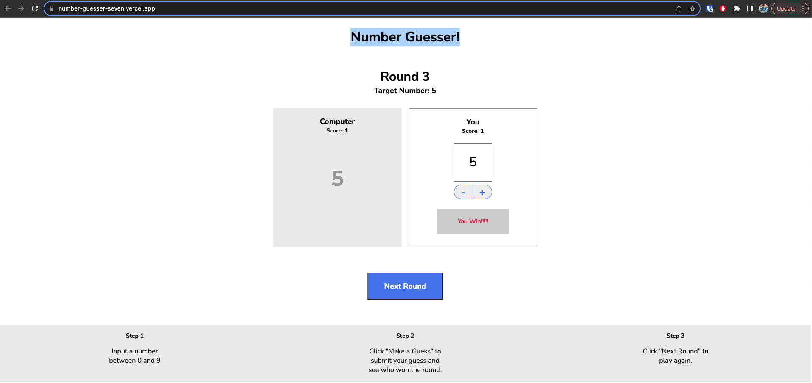

# Number Guesser: A Fun Guessing Game

You can check it out on this link: [Number Guesser](https://number-guesser-seven.vercel.app/) 

Welcome to **Number Guesser**, an exciting guessing game where you can test your intuition and compete against a computer opponent. Put your guessing skills to the test and see if you can outsmart the computer in predicting the target number!

## Game Overview

Number Guesser challenges players to guess a random target number chosen by the computer. The player and the computer each make a guess, and the winner is determined based on their proximity to the target number. The player with the closer guess wins the round and earns a point. The game is played over multiple rounds, and the player with the most points at the end is declared the ultimate winner.

## Features

- **User Interaction:** Input your guess for the target number, and see if you can beat the computer's guess.
  
- **Score Tracking:** The game keeps track of your score and the computer's score as you progress through rounds.

- **Round Advancement:** Each correct guess advances you to the next round, allowing you to play multiple rounds.

## How to Play

1. Open the Number Guesser game in your web browser.

2. Input your guess for the target number in the provided text field.

3. Click the "Make a Guess" button to submit your guess.

4. The computer will also make a guess, and the winner of the round will be determined based on the proximity to the target number.

5. The scores of both you and the computer will be updated based on the outcome of the round.

6. Advance to the next round by clicking the "Next Round" button.

7. Keep playing and challenging the computer to see who can guess closer to the target number!

## Installation

To run the Number Guesser game on your local machine, follow these steps:

1. Clone or download this repository to your local machine.

2. Open the `index.html` file in your web browser.

3. Start guessing numbers and challenging the computer opponent!

## Technologies Used

Number Guesser is built using the following technologies:

- HTML
- CSS
- JavaScript (ES6)

## Acknowledgments

Number Guesser is a project developed as part of a Codecademy course, showcasing the use of JavaScript for game logic and user interaction. The game provides an enjoyable experience to practice guessing and decision-making skills.

## Credits

Special thanks to Codecademy for providing an excellent learning platform and resources for building interactive web applications.

---

Get ready to put your guessing skills to the test with Number Guesser! If you have any questions or feedback, feel free to contact us.

Have fun and enjoy the game! 🎲🤖
